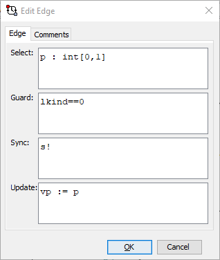
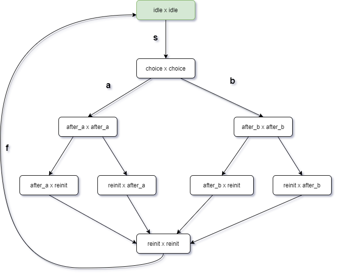
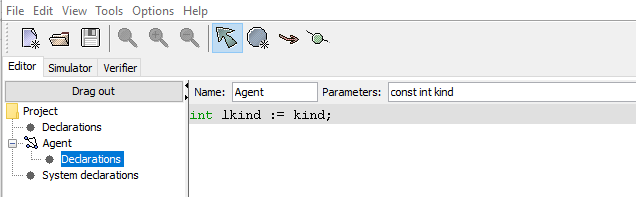

# TP1:  problème du choix distant

Familiarisez vous avec l’outil UPPAAL. 

Le point fort d’Uppaal c’est le temps; ici on ne l’utilise que pour simuler/vérifier des _produits d’automates asynchrone_ (vous verrez le temps l’an prochain).

Ce TP est facile; il faut avoir commencé le TP2 avant la fin de la première séance.

## Étudiez les différents onglets de l’éditeur graphiques

* `editor` qui permet de modifier les _déclarations_; les _templates_ de processus; et la _déclaration du système_
* `simulator` affiche le _système instancié_ et permet d’explorer les états du système
* `verifier` le model-checker intégré à UPPAAL

## Il y a trois types de fichiers (extensions)

* `.xta` format textuel pour définir des _process_ ; déclarer de nouveaux types et constantes; et déclarer le _system_. Vous pouvez écrire directement dans ce format.
* `.ugi` format de déclaration des propriétés graphiques (couleur et emplacement des états, … ). Utilisé en interne par l’outil.
* `.q` format _query_, pour déclarer de nouvelles propriétés
* il y a aussi possibilité d’utiliser un langage `XML`

## Synchronisation en UPPAAL

Les transitions d’un _template_/_process_  UPPAAL peuvent avoir quatre types de propriétés

<figure>
  
  <figcaption>Fig. 1: edit edge in UPPAAL</figcaption>
</figure>

* `select` choix “non-déterministe” d’une valeur 
* `guard` (condition) sur les données
* `sync` synchronisation sur un canal
* `update` mis à jour des données

Une transition sans `sync` est dite interne. Elle peut se déclencher indépendamment des autres instances de process.

Il y a deux _polarités_ sur les canaux `!` (émettre) et `?` recevoir.  On peut émettre sur un canal `a` (noté `a!`) ou recevoir (noté `a?`).

> __Convention:__ on dit que le message transite de `a!` vers `a?`

&nbsp;

> __Convention:__ on exécute toujours l’update de l’émetteur avant celui du récepteur (utile seulement si on a des données)

## Espace d’état d’un système

On peut explorer les états du système en construisant un graphe qui énumère toutes les transitions/synchronisations possibles depuis un état; en partant de  __l’état initial__.

C’est ce qu’on appelle la __sémantique__ du système.

Le _model-checking_, c’est utilisé des formules de logique temporelle pour “poser des questions” sur le graphe, par exemple pour découvrir la présence de _deadlock_ (états sans transitions sortantes); savoir si le système est _vivant_ et/ou ré-initialisable; …

<figure>
  
  <figcaption>Fig. 2: espace d'état pour l'exemple de la question 1</figcaption>
</figure>

## Rappel sur les formules de logique temporelle en UPPAAL

Il existe des formules qui parlent de “l’état courant” du système: conjonction, notée `and`; disjonction, notée `or`; et négation, notée `not`, de _propriétés atomiques_.

* l’instance `gauche` est dans l’état `a` s’écrit `gauche.a`
* la valeur de la variable `cpt` de l’instance `FifoRI` est inférieure à 2  s’écrit `FifoRI.cpt <=2`

Il y a des modalités

* deux _modifiers_  de contexte: `A` (All, ∀) et `E` (Exists, ∃)
* deux modalités temporelles: `[]` (partout, tout le temps) et `<>` (éventuellement) 
* donnent 4 possibilités (`A[]`, `E[]`, `A<>`, `E<>`) + une formule spéciale (_leadsto_) `.. –> ..`

Il est impossible d’imbriquer (d’utiliser) une formule à l’intérieur d’une autre: `E<> gauche.a` est correct, mais pas `(E<> gauche.a) –> gauche.b`

Les formules parlent et quantifient des __chemin maximaux__ dans le __graphe/espace d’état__ du système.

|      |  `[]`                            |  `<>`            |
|:----:|:--------------------------------:|:----------------:|
|  `A` |  __always__                      |  __inevitably__  |
|  `E` |  __potentially__<br />__always__ |  __reachable__   |

> __Exemple de formules classiques:__
>
> * `A[] not deadlock` (invariant) toujours l’état n’est pas un deadlock

## Données et expressions en UPPAAL

On peut définir des variables, en plus des canaux, en utilisant une syntaxe “à la C” avec différents types de données possible

* `int[0,3] x;` déclare une variable `x` qui peut prendre comme valeur 0, 1, 2 ou 3
* `int y;` domaine par défaut
* `int tab[n];` tableau de `n` valeurs, de `tab[0]` à `tab[n-1]`

On peut aussi définir des constantes `const bool KO = false;`

Ces valeurs peuvent être utilisées pour instancier des paramètres, et donc pouvoir définir deux instances d’un même _template_ qui ont des comportements différents.

<figure>
  
  <figcaption>Fig. 3: exemple d'utilisation de paramètres et déclarations locales dans un template</figcaption>
</figure>


```uppaal
gauche = Agent(0);
droit =  Agent(1);

system gauche, droit;
```

## Format textuel

On peut également écrire un modèle UPPAAL directement dans le format XTA (textuel)

```uppaal
int[0,1] vp;
chan s, a, b ;

process Agent(int kind) {
int lkind := kind;
state
    idle,
    choice,
    before_a,
    before_b;
init idle;
trans
    before_b -> idle { guard lkind==1; sync b!;  },
    before_a -> idle { guard lkind==1; sync a?; assign lkind := 1 - lkind;  },
    idle -> choice { guard lkind==1; sync s?;  },
    idle -> choice { select p : int[0,1]; guard lkind==0; sync s!; assign vp := p;  },
    choice -> before_a { guard (vp == 1);  },
    choice -> before_b { guard vp == 0;  },
    before_a -> idle { guard lkind==0; sync a!; assign lkind := 1 - lkind;  },
    before_b -> idle { guard lkind==0; sync b?;  };
}

gauche = Agent(0);
droit =  Agent(1);
system gauche, droit;
```
